# solteq-demo-app

This is demo app for SOLTEQ as part of recruitment process.
Task was described in [this document](https://docs.google.com/viewer?url=https://github.com/jslupicki/solteq-demo-app/raw/master/documentation/SolteqAssignment.pdf).

# How to build and start

`mvnw clean install` and then `java -jar target/demo-app-0.0.1-SNAPSHOT.jar`
Docker image will be build by `mvnw deploy` and can be run by `docker-compose up`
(it need Docker to be installed and running Docker daemon).

# Used tools

* [Spring](https://spring.io/) and [Spring Boot](https://start.spring.io) to manage application, dependency incjection, DAO, web server and more
* [H2](http://www.h2database.com/html/main.html) as database 
* [Vaadin](https://vaadin.com) for UI - I'm "backend guy" so I prefer Java framework.
* [Google Chart](https://developers.google.com/chart) for generating charts
* [OpenCSV](http://opencsv.sourceforge.net) for generating CSV export 
* [Vavr](http://www.vavr.io) for a bit functional programming :-) 

## Usage:

Login page:

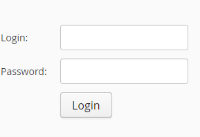

After start 2 users will be available:
* 'admin' with password 'admin' and full access rights
* 'user' with password 'user' and read only rights

After login as 'admin' there is main view of application:

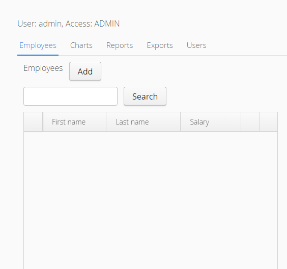

Tabs give access to different function of application:
* Employees - management of employees (search/add/modify/delete)
* Charts - to see charts (currently only one: average salary per month)
* Reports - currently nothing in it (lack of time - plan was to add JasperReport as generator)
* Exports - exports (currently only basic employees data in CSV)
* Users - management of application users (add/modify/delete)

### Employees

After click on `Add` you will see modal window to add new employee with salary and contact information:

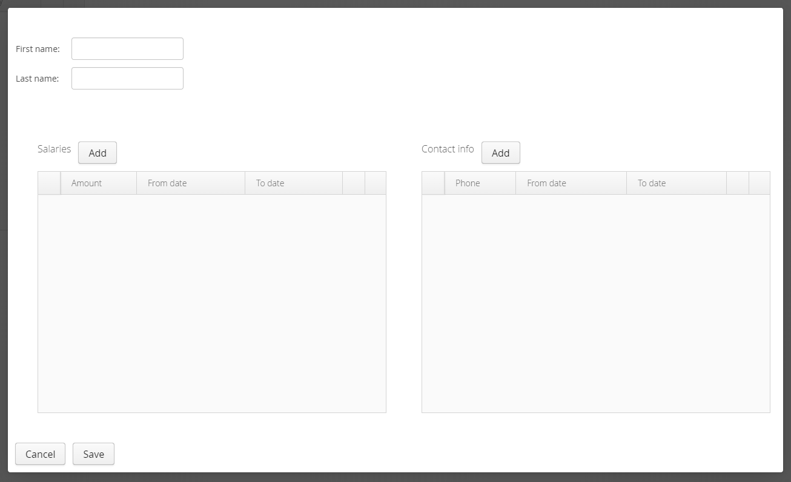

Salaries and contact information can change in time so you can define history of that. Full defined
employee can look like this:

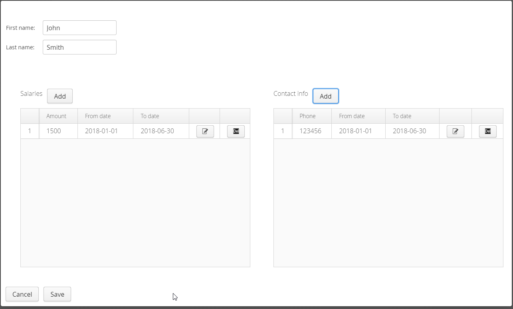

After click `Save` you should see updated list of employees:

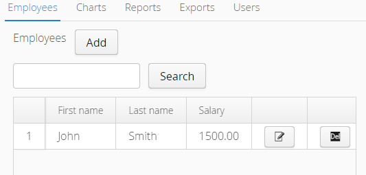

#### Search

Search is of type "full text search" and case independent and it also look to salaries and contact informations.
So if you have defined few more employees:

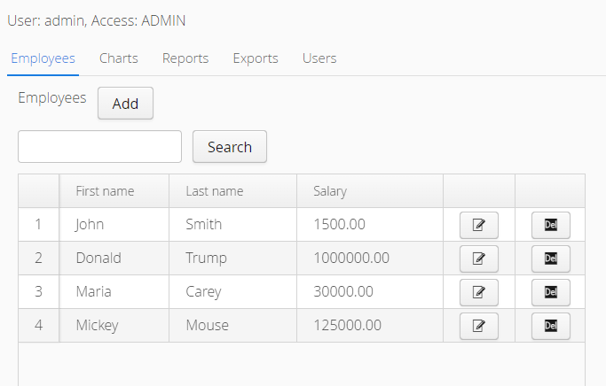

You can search them for `o`:

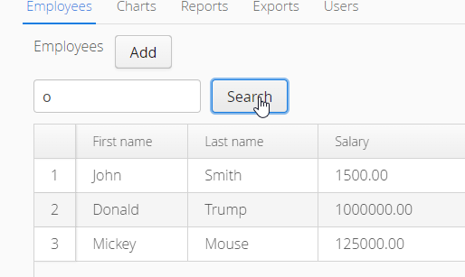

Maria don't have `o` so was filtered out. You can look for her:

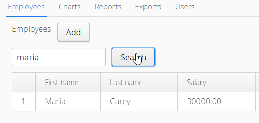

#### Edit

At any time you can edit data of employee by click icon next to him: 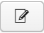 
it opens dialog for editing employees data - the same like for adding but filled with data:

#### Delete

You can also delete employee by click icon 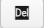 you will see confirmation dialog
preventing accidental delete:

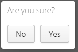 

### Charts

Currently there is only chart with average salary per month. When you first select this tab 
fields from and to date will be fill first and last date of all salaries in database:

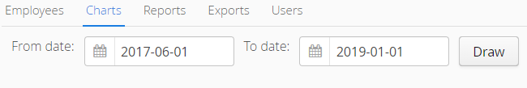

When you click `Draw` chart will be drawn below:

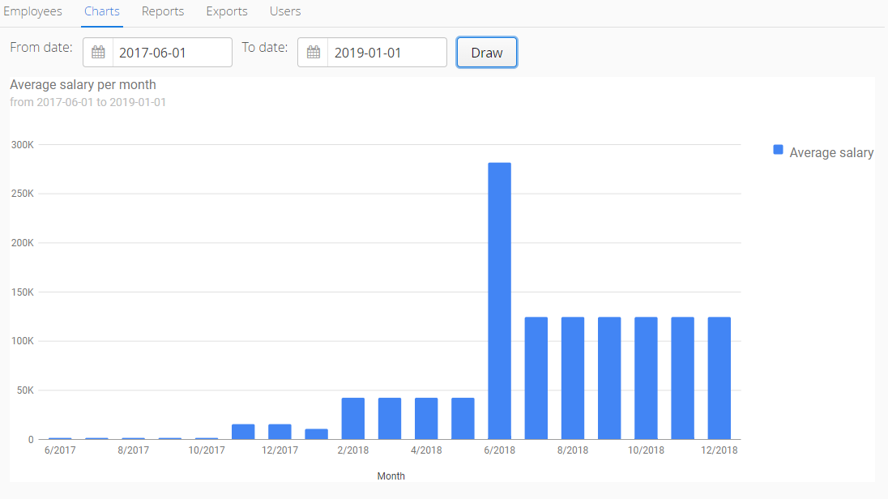

### Reports

Currently there is only report of employees in PDF or HTML. By clicking _Download *_ you 
download employeesReport.pdf or employeesReport.html:

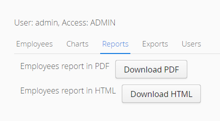

Example of PDF report:

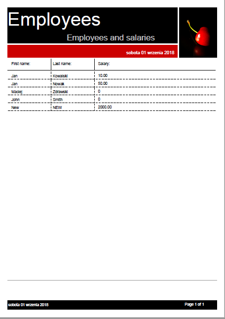

Example of HTML report:

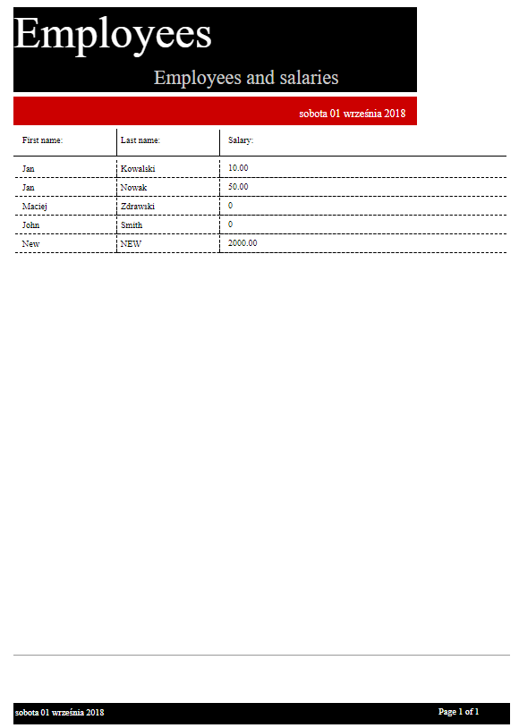

Known problems:
* PDF - no Polish letters
* HTML - no images (should be cherry in right upper corner like in PDF version)

### Exports

Current there is only possibility to export basic data (first name and last name) of all employees:

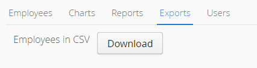

After click on `Download` file `employees.csv` will be downloaded on you computer.

### Users

On `Users` tab there is simple management of application users:

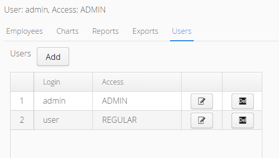

Usage is similar to this from Empleyees tab:

After click `Add`

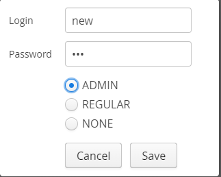

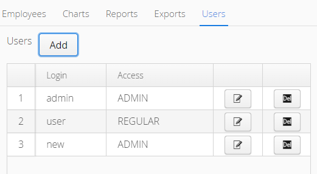

  